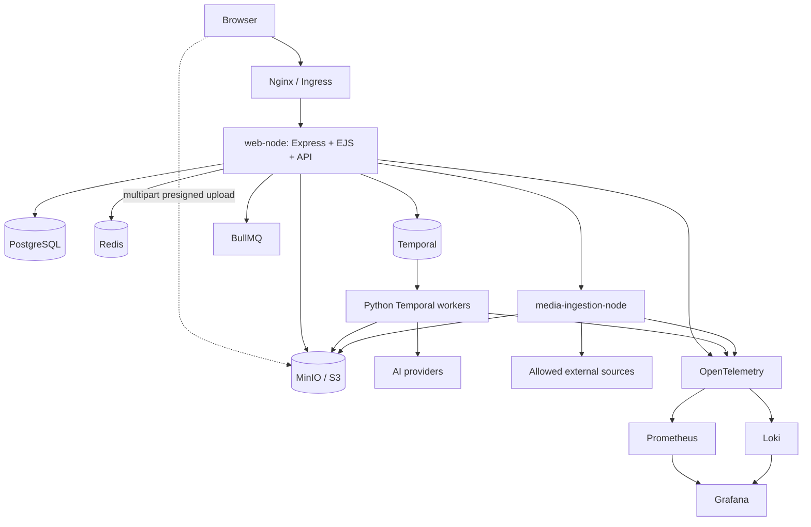

# Architecture

## Product understanding

Creator Studio AI is a multi-tenant creator workspace for auto clipping, natural speech generation, transcription/subtitle authoring, media review, and official social publishing. Work is represented as durable jobs with stage progress, attempts, user-friendly logs, usage records, outputs, and audit history.

## Core decisions

- A Node.js modular monolith is the first deployment unit.
- Python workers are separate because media and AI dependencies have different runtime, scaling, and GPU needs.
- Temporal owns durable workflow execution; PostgreSQL owns user-facing projections and business records.
- MinIO/S3 owns media bytes. PostgreSQL stores metadata and object keys.
- BullMQ is restricted to short tasks such as email, webhook, notification, and publish polling.
- SSE is the default browser progress channel; polling remains available.
- Provider integrations use capability-based adapters and encrypted credential resolution.

## Context diagram

## Source of truth

| Concern | Source of truth |
|---|---|
| Users, roles, plans, jobs, assets | PostgreSQL |
| Workflow execution and durable timers | Temporal |
| Media bytes | Object storage |
| Session cache, rate counters, realtime fan-out | Redis |
| Short async jobs | BullMQ |
| Metrics and alerts | Prometheus/Grafana |
| Technical logs | Loki or selected OTel backend |

## Progress projection

Python activities call a service-authenticated internal endpoint. Node atomically increments `Job.eventSequence`, writes `JobEvent`, updates `Job`, and publishes a lightweight Redis notification. SSE subscribers then fetch authoritative events from PostgreSQL.

This avoids treating Redis as durable storage and prevents Temporal history from becoming the only UI data source.

## Media validation boundary

Uploaded media lands in object storage first. The Node upload flow only validates request-shape concerns such as ownership, MIME/extension, size, and multipart integrity. Deeper media inspection such as FFprobe-derived duration, resolution, codecs, frame rate, rotation, and audio-stream presence belongs to Python workers. Python then reports the validation result back to Node through a service-authenticated internal endpoint so PostgreSQL remains the source of truth for `MediaAsset` readiness.

The same boundary now extends into the early Phase 2 auto-clipping pipeline. When a job does not include precomputed `analysis_inputs`, the Python workflow can fetch a validated media asset context, extract a stable WAV audio artifact, run transcription, and derive minimal transcript-first analysis inputs before candidate ranking begins.

## Multi-tenancy

The initial model uses a shared database and schema. Every tenant-owned query includes `userId` or traverses a tenant-owned aggregate. Signed media URLs are generated only after an ownership or admin-permission check.

## Impersonation

View-as-user never replaces the actor identity. Session data stores both the actor and target context. Admin permission checks use the actor; workspace data uses the effective user. Starting and stopping impersonation requires a reason and writes audit entries.
