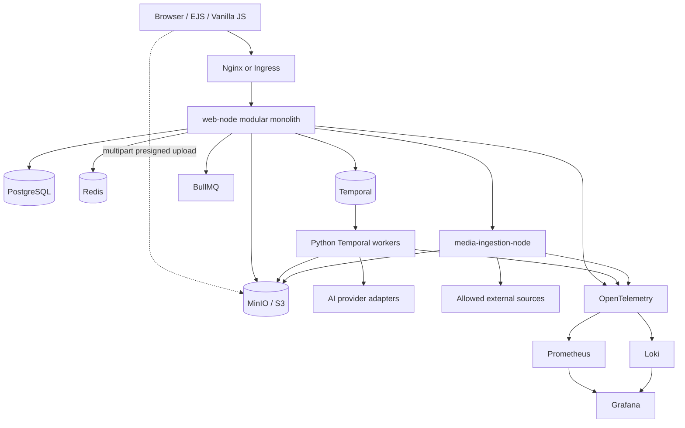
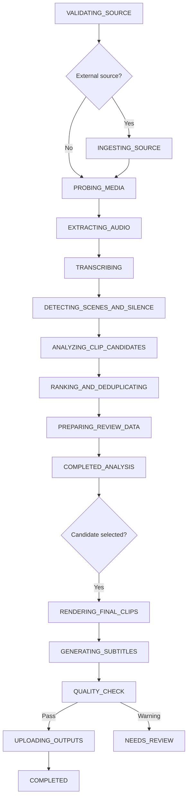
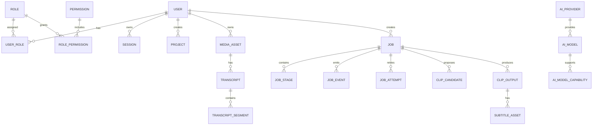
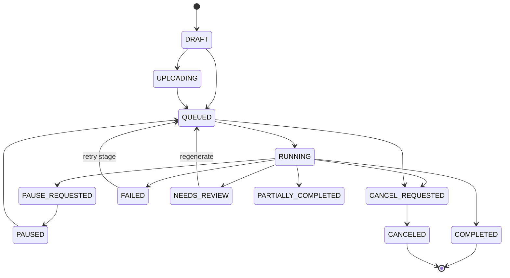

# Creator Studio AI - Product and Architecture Blueprint

This document follows the requested delivery order. Detailed implementation notes live in the linked topic documents.

## 1. Product understanding

Creator Studio AI is a multi-tenant creator workspace for durable media jobs: long-video auto clipping, text-to-speech, transcription/subtitle authoring, result review, download, and official-platform publishing. Users may use platform-owned AI credentials or encrypted credentials of their own. Superadmins operate the platform and may enter an audit-safe view-as-user context without replacing their actor identity.

## 2. Assumptions and architecture decisions

- Node.js is a modular monolith for browser-facing concerns, business records, billing/quota, job commands, and projections.
- Python owns AI inference and media processing. FFmpeg, Whisper, OpenCV, scene detection, and rendering never run in Node.
- Temporal owns durable execution; PostgreSQL owns product-facing state; MinIO/S3 owns media bytes.
- BullMQ is restricted to short jobs such as email, webhooks, notifications, and publish polling.
- Large media never crosses service REST APIs. Services exchange object keys and short-lived signed URLs.
- SSE is the default progress channel with cursor-based polling fallback.
- Provider capabilities and credentials are resolved through adapters, not hard-coded into use cases.
- Shared-schema multi-tenancy is used initially; every tenant query enforces ownership.

## 3. Architecture diagram



## 4. Auto-clipping workflow



Phase 1 includes the durable workflow envelope, progress projection, cancellation, and attempts. Phase 2 now extends this into transcript-driven candidate analysis, runtime-configurable analyzer fallback (`openai_then_heuristic`, `heuristic_then_openai`, `heuristic`), automatic render queueing, final clip rendering, subtitle generation/burn-in, artifact persistence, export indexes, and in-place regenerate flows.

## 5. Final repository structure

```text
creator-studio-ai/
|-- apps/
|   |-- web-node/
|   |-- media-ingestion-node/
|   `-- ai-media-python/
|-- packages/
|   `-- contracts/
|-- infra/
|   |-- docker/
|   |-- kubernetes/
|   |-- monitoring/
|   `-- scripts/
|-- docs/
|-- AGENTS.md
|-- CONTRIBUTING.md
|-- README.md
|-- .env.example
|-- docker-compose.yml
`-- Makefile
```

## 6. Modules and responsibilities

| Module | Responsibility |
|---|---|
| auth | Registration, login, Google OAuth, verification, reset, session rotation |
| users | Profile, locale, timezone, security preferences |
| jobs | State, stages, events, attempts, retry, cancel, SSE |
| uploads | Multipart session, presigned parts, completion and abort |
| auto-clipping | Request validation, snapshots, workflow start, duplicate/regenerate, render/runtime setting capture |
| ai-providers | Providers, models, capabilities, routing, encrypted credential resolution |
| media-library | Media metadata, ownership, retention, signed preview/download |
| publishing | Connections, destinations, capability flags, background publishing |
| billing | Plans, quota reservation/settlement, usage records |
| audit | Security and administrative action history |
| ingestion | Legally allowed external retrieval and SSRF-safe validation |
| Python worker | Durable AI/media activities and provider/media adapters |

## 7. Database ERD and Prisma schema



The complete schema is in `apps/web-node/prisma/schema.prisma`; the baseline migration is in `apps/web-node/prisma/migrations/202606260001_init/migration.sql`.

## 8. Job state machine



Completed jobs are never ambiguously restarted. Duplicate creates a new job; manual retry creates a new attempt/workflow ID. Regenerate reuses the same job while replacing render/result artifacts with a newer attempt snapshot.

## 9. Main API contract

Base path: `/api/v1`.

- Auth: register, login, logout, verify email, forgot/reset password, Google OAuth, current identity.
- Uploads: create multipart upload, complete, abort.
- Jobs: list/detail, events, SSE stream, cancel, retry, delete.
- Auto clipping: create, duplicate, regenerate.
- Internal: service-authenticated progress projection and worker callbacks.

Mutating workflow operations require `Idempotency-Key`. Errors use a stable envelope containing `code`, safe `message`, `request_id`, and optional `details`.

## 10. UI sitemap and principal pages

```text
/auth: login, register, verify, forgot/reset
/app/dashboard
/app/tools/auto-clipping
/app/tools/text-to-speech
/app/tools/transcription
/app/jobs/:jobId
/app/publishing
/app/presets
/app/usage
/app/settings/*
/admin/dashboard
/admin/users
/admin/media
/admin/roles
/admin/jobs
/admin/providers
/admin/models
/admin/credentials
/admin/plans
/admin/audit-logs
/admin/workers
/admin/settings
```

The auto-clipping form uses a four-step wizard: Source, Content Strategy, Visual & Subtitle, Review & Submit. Quick mode precedes advanced controls, while visual/subtitle settings expose selectable layout, subtitle style, max lines, safe margins, burn-in, highlight behavior, and related render options directly in the user flow.

## 11. Threat model and security checklist

Primary threats are account takeover, broken object authorization, secret leakage, malicious media, SSRF, workflow/quota abuse, prompt injection, and unsafe impersonation. Implemented foundations include Argon2id, secure sessions, rotation, CSRF, rate limits, RBAC, ownership filtering, audit context, log redaction, presigned upload, service authentication, and SSRF-aware ingestion validation. Production mTLS, KMS integration, malware engine selection, enforced superadmin TOTP, and a penetration test remain release gates.

## 12. Docker Compose development

Compose includes PostgreSQL, Redis, MinIO/init, Temporal/UI, migration and seed jobs, Node web/email worker, ingestion service, Python API/worker, Mailpit, Prometheus, Grafana, Loki, and OpenTelemetry Collector. Web starts only after the migration job succeeds. Destructive migrations are never automatic.

## 13. Kubernetes production plan

- Separate deployments for web, ingestion, BullMQ worker, CPU Temporal worker, and optional GPU worker.
- Migration as a dedicated Job.
- HPA for web request load and worker backlog/schedule-to-start latency.
- Readiness, liveness, startup probes, PDB, resource requests/limits, service accounts, and NetworkPolicy.
- Managed/HA PostgreSQL, Redis, Temporal, and object storage rather than single containers.
- External secret manager/KMS, ingress TLS, private internal services, and controlled ingestion egress.

## 14. Roadmap

1. Phase 1: foundation included in this repository.
2. Phase 2: FFprobe, faster-whisper, scene/silence analysis, structured analyzer with heuristic fallback, crop, subtitle, render, export indexes, regenerate, and quality checks.
3. Phase 3: active-speaker tracking, split-screen, advanced reframing, editor, brand presets.
4. Phase 4: TTS provider abstraction, duration assistance, transcript editor, subtitle translation/burn-in.
5. Phase 5: official publishing, quota settlement/billing, autoscaling, provider routing, and cost dashboards.

## 15. Source code starting points

Start with `README.md`, then read `AGENTS.md`, `docs/architecture.md`, `docs/workflows.md`, and `docs/security.md` before extending the code.
