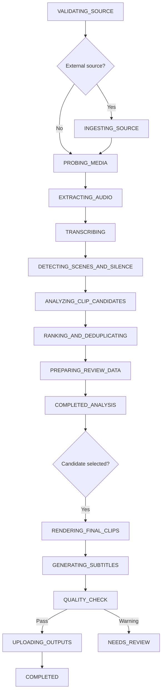

# Workflows

## Auto clipping target workflow

Notes:

- Candidate selection now auto-queues render output creation. The user no longer needs a separate manual "queue render" action.
- The worker now prioritizes a single final render artifact plus subtitles, thumbnail, and metadata. A separate preview MP4 is optional and can be skipped to reduce storage.
- Candidate analysis may run via OpenAI structured output or the local Python heuristic engine depending on the analyzer runtime mode captured when the job was created or regenerated.
- Long-running candidate analysis must heartbeat while waiting on provider responses so Temporal timeouts do not incorrectly fail healthy analyzer work.

## Current workflow behavior

The included Python worker now runs the real auto-clipping foundation pipeline: request validation, optional external-source materialization, FFprobe/media preparation, audio extraction, transcription, scene/silence enrichment, candidate analysis, ranking, final rendering, subtitle generation, validation, and output persistence. `NEEDS_REVIEW` remains available for genuine validation or render-review cases; it is no longer the default end-state for all jobs.

## Activity requirements

Every media activity added in Phase 2 must define:

- start-to-close timeout;
- heartbeat timeout for long-running operations;
- retry policy and non-retryable error types;
- activity idempotency key;
- cancellation checks;
- structured progress events;
- checkpoint object key;
- temporary-file cleanup;
- versioned output object key.

## Retry semantics

- Automatic activity retries stay inside the same workflow run.
- Manual retry creates a `JobAttempt` and starts a new workflow ID for the same job.
- Completed outputs are immutable and versioned.
- Duplicate creates a new job and copies the prior input snapshot.
- Regenerate reuses the same job while replacing generated outputs with the latest render/input snapshot.

## Cancellation

Node requests Temporal cancellation and records `CANCEL_REQUESTED`. Python activities must heartbeat and allow cancellation to propagate. The internal projection marks the job `CANCELED` only after the workflow confirms cancellation.
