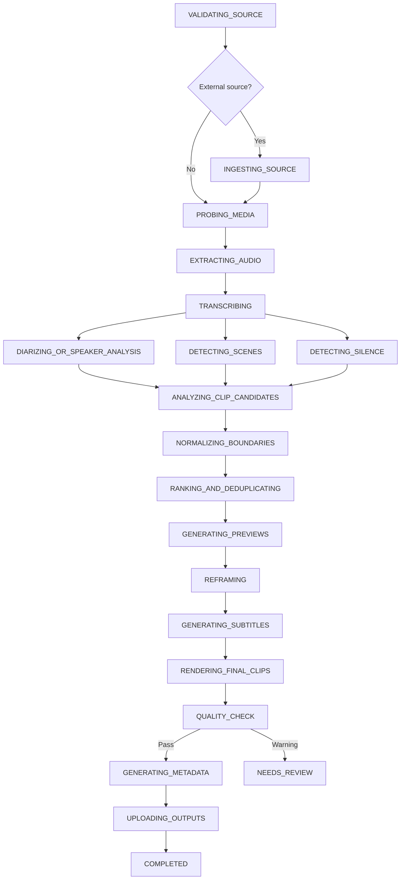

# Workflows

## Auto clipping target workflow

## Phase 1 workflow

The included Python worker proves cross-language orchestration and progress projection. It validates the request envelope, emits progress, creates durable history, supports cancellation, and deliberately ends an auto-clipping job as `NEEDS_REVIEW` with a message that Phase 2 media activities are not enabled. It never fabricates clip output.

## Activity requirements

Every media activity added in Phase 2 must define:

- start-to-close timeout;
- heartbeat timeout for long-running operations;
- retry policy and non-retryable error types;
- activity idempotency key;
- cancellation checks;
- structured progress events;
- checkpoint object key;
- temporary-file cleanup;
- versioned output object key.

## Retry semantics

- Automatic activity retries stay inside the same workflow run.
- Manual retry creates a `JobAttempt` and starts a new workflow ID for the same job.
- Completed outputs are immutable and versioned.
- Duplicate creates a new job and copies the prior input snapshot.

## Cancellation

Node requests Temporal cancellation and records `CANCEL_REQUESTED`. Python activities must heartbeat and allow cancellation to propagate. The internal projection marks the job `CANCELED` only after the workflow confirms cancellation.
